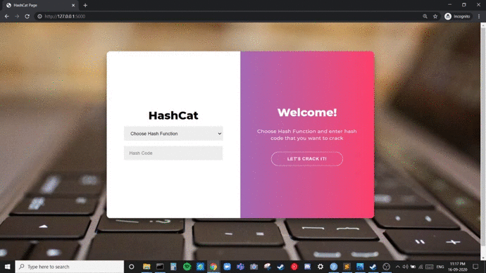

# HASHCAT Implementation

Hashcat is a password recovery tool. It had a proprietary code base until 2015, but was then released as open source software. Versions are available for Linux, OS X, and Windows. The hashcat-supported hashing algorithms are LM hashes, MD4, MD5, SHA-family and Unix Crypt formats as well as algorithms used in MySQL and Cisco PIX.

We have implemented our version of HashCat in the Python programming language using the Flask framework.

Hash functions implemented - 
> 1. SHA256
> 2. SHA384
> 3. SHA224
> 4. SHA512
> 5. SHA1
> 6. MD5
> 7. MD4

### Hash Function

###### SHA-256
SHA-256 (secure hash algorithm, FIPS 182-2) is a cryptographic hash function with digest length of 256 bits. It is a keyless hash function; that is, an MDC (Manipulation Detection Code). A message is processed by blocks of 512 = 16 × 32 bits, each block requiring 64 rounds.

###### SHA-384
SHA-384 belongs to the SHA-2 family of cryptographic hashes. It produces the 384 bit digest of a message. SHA-384 is roughly 50% faster than SHA-224 and SHA-256 on 64-bit machines, even if its digest is longer. The speed-up is due to the internal computation being performed with 64-bit words, whereas the other two hash functions employ 32-bit words.

###### SHA-224
SHA-224 belongs to the SHA-2 family of cryptographic hashes. It produces the 224 bit digest of a message. Computation of a SHA-224 hash value is two steps.  First, the SHA-256 hash value is computed, except that a different initial value is used.  Second, the resulting 256-bit hash value is truncated to 224 bits.

###### SHA-512
SHA-512 and its two truncated variants (SHA-512/224 and SHA-512/256) belong to the SHA-2 family of cryptographic hashes. The speed-up is due to the internal computation being performed with 64-bit words, whereas the other two hash functions employ 32-bit words.

###### SHA-1
In cryptography, SHA-1 (Secure Hash Algorithm 1) is a cryptographic hash function that takes an input and produces a 160-bit (20-byte) hash value known as a message digest – typically rendered as a hexadecimal number, 40 digits long.

###### MD-4
MD4 is a message digest algorithm (the fourth in a series) designed by Professor Ronald Rivest of MIT in 1990. It implements a cryptographic hash function for use in message integrity checks. The digest length is 128 bits. The algorithm has influenced later designs, such as the MD5, SHA and RIPEMD algorithms.

###### MD-5
The MD5 hashing algorithm is a one-way cryptographic function that accepts a message of any length as input and returns as output a fixed-length digest value to be used for authenticating the original message.The MD5 hash function was originally designed for use as a secure cryptographic hash algorithm for authenticating digital signatures.

### Tech Stack
> 1. Python
> 2. HTML5
> 3. CSS3
> 4. Flask

### File Description
> 1. HashCat.css - CSS code for frontend 
> 2. HashCat.html - HTML code for frontend
> 3. Hashapp.py - Flask program module

### Installation and Execution
urllib3, hashlib and Flask can be installed using pip:

    $ python3 -m pip install urllib3
    
    $ python3 -m pip install hashlib
    
    $ pip install Flask

To run the application, go to the folder with the files and open the command prompt directed to the current directory. Then give the following commands - 

    $ set FLASK_APP = hashapp
    $ flask run

For Output - Go to http://127.0.0.1:5000/ to open the page

### Implementation snippets 

---
###### Future Work
There are currently two versions of the tool available: Hashcat and oclHashcat, one to use CPU and one to use GPU. We can expect the final version of Hashcat and the most important news will be the fusion of the two tools. Not only that, but you’ll also be able to utilize both CPU and GPU, even in parallel, and it will support exotic hardware like FPGA and DSP.

###### References
[1] Binnie, Chris. (2016) - Password Cracking with Hashcat. 10.1002/9781119283096.ch9. https://www.researchgate.net/publication/316361921_Password_Cracking_with_Hashcat/

[2] Hashcat Password Cracking (Linux) https://medium.com/armourinfosec/hashcat-password-cracking-linux-97f91cdf0e47

[3] Hashcat Tutorial for beginners https://resources.infosecinstitute.com/hashcat-tutorial-beginners/#gref

[4] What Should I Know About Hashcat? https://www.alvareztg.com/what-should-i-know-about-hashcat/

### Contributors
> * 1711008 Sagar Dama <sagar.ud@somaiya.edu>
> * 1711010 Heeral Dedhia <heeral.d@somaiya.edu>
> * 1711011 Arnab Dey <arnab.de@somaiya.edu>
> * 1711017 Harsh Gokhru <harsh.gokhru@somaiya.edu>

### Try it out
https://repl.it/@Hgokhru101/HashCat
